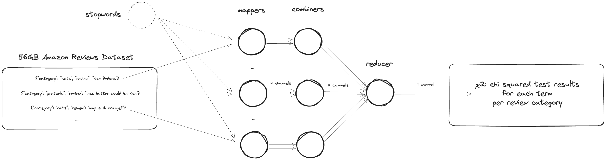

The $\chi^2$ statistic [^chi] measures the dependence between categorical stochastic variables. It can help with feature selection / dimensionality reduction in text classification.

In this case we're dealing with 2 independent variables: terms $t$ from categories $c$ of reviews from the Amazon Review Dataset (2014) [^amazon]. We therefore need to compute a 2x2 contingency table for each term-category pair.

$$
\chi_{tc}^2=\frac{N(AD-BC)^2}{(A+B)(A+C)(B+D)(C+D)}
$$

where:

-   $N$ = total number of retrieved documents (can be left out if you only care about ranking order, not scale)
-   $A$ = number of documents that are: in $c$ and contain $t$
-   $B$ = number of documents that are: not in $c$ and contain $t$
-   $C$ = number of documents that are: in $c$ and don't contain $t$
-   $D$ = number of documents that are: not in $c$ and don't contain $t$

When computing this statistic, for datasets too large to fit into memory, we can use the MapReduce pattern to distribute the computation across multiple nodes.

The MapReduce pattern consists of 3 steps:

-   Mapping: $(k, v) \rightarrow [(k', v')]$
    -   each map tasks receives one or more chunks of the distributed filesystem as unique key-value pairs
    -   keys are ignored unless you're piping data from one map task to another
    -   keys don't have to be unique
    -   values are processed by the map function
-   Grouping: $(k', [v']) \rightarrow [(k', [v'])]$
    -   the key-value paris are collected by the master process, then grouped if they have the same key
    -   each list with the same key gets then sent to the same process
-   Reducing: $(k', [v']) \rightarrow [(k', v')]$
    -   reduce tasks process one key-list entry at a time, with a list of all values associated with that key
    -   the result can be either piped to another task or emitted as the final output

For the $\chi^2$ computation on our review dataset this would translate to the following steps:

**Mapping:** Initially the data is spread across many storage nodes. The master process redistributes the data and assigns a map task to each node, which processes the data and emits intermediate key-value pairs. In our case this is where the preprocessing of the individual lines each containing a review and a category takes place. After preprocessing the text (tokenization, lowercasing, removing punctuation, stemming, etc.), we emit "messages" on 2 different "channels" to the reducer: one for the term-category pairs `((t, c), 1)` and one for the total number of documents / lines in each category `((none, c,) 1))`.

**CSP style messaging:** The whole "channel" concept from the CSP concurrency model [^go] is a bit of a stretch here, but it's a good analogy to understand the concept. Essentially because there are more tokens than categories, we can't derive the number of categories from the number of tokens. Additionally, we also require the number of lines / documents - but fortunately since each line exactly corresponds to one category, we can use the number of lines as a proxy for the number of categories. But either way, a single emit instruction can't carry all the information we need.

We therefore either have to run 2 separate MapReduce jobs - which is inefficient - or we can emit the term-category pairs and the category counts separately and then group them in the reducer. To do so we can make up a dummy key `(none, c)` that is easy to distinguish from `(t, c)`. This is analogous to the "channels" in the CSP model, where we can send messages on different channels to different processes and then merge them in a single process. Efficiency at the cost of complexity.

**Combining:** To optimize network traffic, we can use a combinator function to merge the intermediate results on the same node as the map task. This way we can reduce the amount of data that needs to be transferred to the reducer. Given the high latency of network communication compared to local computation, this always results in a performance improvement. We do this by incrementing the value / counters `1` on each occurrence of a term/none-category pair to `n`. The combiner then passes these values forward to the same reducer by using the the dummy key `none` in all cases: `(none, (t|none, n))`.

**Reducing:** In the reducer we then calculate the $\chi^2$ statistic for each term-category pair and output the results. First we derive the total number of documents from the number of categories. Then sum up the number of terms per category and the number of categories per term. Finally we calculate the $\chi^2$ statistic for each term-category pair and output the results.

Because I wanted to emit the 75 highest $\chi^2$ values of terms per category before the dumping the entire dictionary I was bottlenecked from both sides: First because each chunk needed to be aware of the total number of documents and the number of categories and second because the reducer needed to keep track of the 75 highest values. This is why I decided to use a single reducer and a single mapper.

It wasn't an issue because although I had to store a fraction of the _entire_ dataset in the memory of a single node, the dataset was small enough to fit into memory. This is a common tradeoff in distributed computing: you can either optimize for network traffic or for memory usage. In this case I optimized for memory usage. But in practice you would want to scale the number of your mappers and reducers according to the size of your dataset vs. the memory of your nodes.

There is no one-size-fits-all solution to this problem. It depends on the size of your dataset, the memory of your nodes, the network speed, the number of nodes, the number of mappers and reducers, the complexity of your computation, and many other factors. This is why distributed computing is such a complex field. I wouldn't recommend using this code in production, but the hacky channel approach was a fun experiment.

# Benchmarking

I benchmarked the code both locally and on the Jupyter cluster at the HPC lab at TU Wien. The specs are as follows:

-   Local specs: Darwin Yahyas-MacBook-Pro.local 23.2.0 Darwin Kernel Version 23.2.0: Wed Nov 15 21:55:06 PST 2023; root:xnu-10002.61.3~2/RELEASE_ARM64_T6020 arm64 (MacBook Pro M2 16GB RAM)
-   Cluster specs: Linux jupyter01.lbd.hpc.tuwien.ac.at 4.18.0-513.11.1.el8_9.x86_64 #1 SMP Wed Jan 10 22:58:54 UTC 2024 x86_64 x86_64 x86_64 GNU/Linux (12-node Hadoop cluster, ~100GB RAM)

The dataset processed is the Amazon Review Dataset (2014) [^Amazon], which contains 142.8 million reviews from 24 product categories and is 56GB in size. The dev dataset is a reduced (0.1%) sample of the full dataset and is included in the `data` directory. I used the reduced dataset for local testing and both the reduced and full datasets for cluster testing stored in HDFS.

I ran each test 12 times using the `time` module in Python to exclude the time taken to start the Python interpreter and load the code and took the average of the 12 runs.

The instructions for each run were as follows:

```bash
# local
python3 ./src/run.py ./data/reviews_devset.json --stopwords ./data/stopwords.txt > output.txt

# cluster: dev dataset
python3 run.py -r hadoop --hadoop-streaming-jar /usr/lib/hadoop/tools/lib/hadoop-streaming-3.3.5.jar hdfs:///user/dic24_shared/amazon-reviews/full/reviews_devset.json --stopwords stopwords.txt > output.txt

# local: full dataset
python3 run.py -r hadoop --hadoop-streaming-jar /usr/lib/hadoop/tools/lib/hadoop-streaming-3.3.5.jar hdfs:///user/dic24_shared/amazon-reviews/full/reviewscombined.json --stopwords stopwords.txt > output.txt
```

I also played around with the `--jobconf mapred.map.tasks=50 --jobconf mapred.reduce.tasks=50` parameters to see if I could improve performance, but the results were inconclusive.

The results are as follows:

-   Local: 12.17s average
-   Cluster (dev dataset): 77.53s average
-   Cluster (full dataset): varies too much based on cluster load ranged anywhere from 10 minutes to 1 hour

So overall, despite this being a toy implementation in a prototyping language, the performance should suffice for small-scale testing.

# Footnotes

Introduction to MapReduce:

-   https://www.dcs.bbk.ac.uk/~dell/teaching/cc/book/mmds/mmds_ch2_2.pdf
-   https://www.semanticscholar.org/paper/Chapter-2.-Map-reduce-and-the-New-Software-Stack-to/78266ccf40d9e62ce0ea75568adf68175f3ac9c6
-   http://infolab.stanford.edu/~ullman/mmds/ch2.pdf
-   https://github.com/lintool/mapreducealgorithms

Concrete examples from the MRJob documentation:

-   https://mrjob.readthedocs.io/en/latest/guides/writing-mrjobs.html
-   https://mrjob.readthedocs.io/en/latest/guides/writing-mrjobs.html#setup-and-teardown-of-tasks

[^chi]: https://web.pdx.edu/~newsomj/pa551/lectur11.htm
[^amazon]: https://amazon-reviews-2023.github.io/
[^go]: https://www.cs.princeton.edu/courses/archive/fall16/cos418/docs/P1-concurrency.pdf
