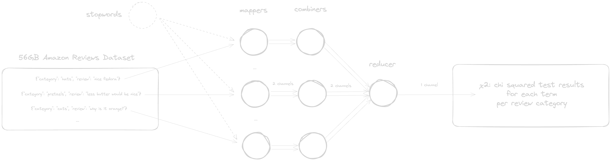

The goal of this assignment is to implement a MapReduce job that calculates the Pearson's $\chi^2$ statistic for each term in each category of the Amazon Review Dataset. The $\chi^2$ statistic measures the significance of a term in a category. It can help with feature selection / dimensionality reduction in text classification.

# Benchmarking

I benchmarked the code both locally and on the Jupyter01 cluster at the TU Wien HPC lab.

-   Local specs: Darwin Yahyas-MacBook-Pro.local 23.2.0 Darwin Kernel Version 23.2.0: Wed Nov 15 21:55:06 PST 2023; root:xnu-10002.61.3~2/RELEASE_ARM64_T6020 arm64 (MacBook Pro M2 16GB RAM)
-   Cluster specs: Linux jupyter01.lbd.hpc.tuwien.ac.at 4.18.0-513.11.1.el8_9.x86_64 #1 SMP Wed Jan 10 22:58:54 UTC 2024 x86_64 x86_64 x86_64 GNU/Linux (12-node Hadoop cluster, ~100GB RAM)

The dataset to be processed is the [Amazon Review Dataset 2014](https://amazon-reviews-2023.github.io/), which contains 142.8 million reviews from 24 product categories and is 56GB in size. The dev dataset is a reduced (0.1%) sample of the full dataset and is included in the `data` directory. I used the reduced dataset for local testing and both the reduced and full datasets for cluster testing stored in HDFS.

I ran each test 12 times using the `time` module in Python to exclude the time taken to start the Python interpreter and load the code and took the average of the 12 runs.

The instructions for each run were as follows:

```bash
# local
python3 ./src/run.py ./data/reviews_devset.json --stopwords ./data/stopwords.txt > output.txt

# cluster: dev dataset
python3 run.py -r hadoop --hadoop-streaming-jar /usr/lib/hadoop/tools/lib/hadoop-streaming-3.3.5.jar hdfs:///user/dic24_shared/amazon-reviews/full/reviews_devset.json --stopwords stopwords.txt > output.txt

# local: full dataset
python3 run.py -r hadoop --hadoop-streaming-jar /usr/lib/hadoop/tools/lib/hadoop-streaming-3.3.5.jar hdfs:///user/dic24_shared/amazon-reviews/full/reviewscombined.json --stopwords stopwords.txt > output.txt
```

I also played around with the `--jobconf mapred.map.tasks=50 --jobconf mapred.reduce.tasks=50` parameters to see if I could improve performance, but the results were inconclusive.

The results are as follows:

-   Local: 12.17s
-   Cluster (dev dataset): 77.53s
-   Cluster (full dataset): varies too much based on cluster load ranged anywhere from 10 minutes to 1 hour

So overall, despite this being a toy implementation with a prototyping language, the code performed decent enough to suffice for small scale testing under the given circumstances.

<br><br><br><br>

# –––––––––––––––––––––––––––––––––––––––––––––

`<groupID>_DIC2024_Ex1.zip` must contain:

-   `output.txt`: results obtained
-   `report.pdf`: written report

    -   max 8 pdf pages of A4 size in total
    -   section 1: introduction
    -   section 2: problem overview: chi squared measures significance of a term in a category. it can help with feature selection / dimensionality reduction in text classification.
    -   section 3: methodology and approach, must include a figure illustrating the strategy and pipeline in one figure must show the data flow clearly and indicate the chosen `<key,value>` design (all input, intermediary, and output pairs).
    -   section 4: conclusions

-   `src/`: subdirectory with source code of MapReduce implementation + script to run all jobs in the correct order with all necessary parameters.
    -   use arguments to pass the hdfs input path and the local output path to the script because the paths will change when the code is run on the cluster.
    -   code must be correct, well documented, and efficient (you will have a runtime limit - the best times last term were <20 minutes).

# don't use inproduction

## when does hadoop make sense?

when working with big data you can't just load everything from storage into memory and process it. you have to split the data into chunks and process them in parallel. This is called data parallelism. Hadoop and MapReduce are examples of data parallelism.

don't mistake them for task parallelism where you share compute.

most hadoop tasks are IO bound, not CPU bound - they rarely utilize the CPU to its full potential.

therefore the number of mappers and reducers you instantiate should be based on the number of cores you have, not the number of nodes.

if you have too many reduce tasks (ie. don't use combiners to merge intermediate results) you will have a lot of network calls.

network calls cause higher latency than disk IO.

in fact, if you look at the history of computing, the latency of network has always progressed significantly slower than the latency of disk io. additionally if you have a lot of network calls, you will have a lot of network congestion.

this is why RDMA and Infiniband are so important for big data. it's the greatest bottleneck.

don't use Hadoop for small data. it's not worth it. use a database.

ie. in this example were processing ~50GB of data from the amazon reviews dataset on a server with over ~100GB of RAM. we could have loaded the entire dataset into memory and processed it in a few seconds. but we're using Hadoop for the sake of learning.

having said that - it also becomes clear why we have reduced the number of mappers and reducers to 1. we don't have enough data to justify more than 1 mapper and 1 reducer. but in a real world scenario, you would want to scale accordingly.

## when does mrjob make sense?

setting up hadoop is a pain. mrjob is a python library that abstracts away the complexity of hadoop and allows you to write mapreduce jobs in python.

it doesn't require you to have hadoop installed. it can run on your local machine and you can pass the hadoop binary to it if you want to run it on a cluster.

it's the convenience - but in production i suggest you use hadoop.

# mapreduce

mapreduce and the new software stack:

-   see: https://www.dcs.bbk.ac.uk/~dell/teaching/cc/book/mmds/mmds_ch2_2.pdf
-   see: https://www.semanticscholar.org/paper/Chapter-2.-Map-reduce-and-the-New-Software-Stack-to/78266ccf40d9e62ce0ea75568adf68175f3ac9c6
-   see: http://infolab.stanford.edu/~ullman/mmds/ch2.pdf
-   see: https://github.com/lintool/mapreducealgorithms

mrjob docs for an example:

-   see: https://mrjob.readthedocs.io/en/latest/guides/writing-mrjobs.html
-   see: https://mrjob.readthedocs.io/en/latest/guides/writing-mrjobs.html#setup-and-teardown-of-tasks

```python
def mapper(self, _, line): # returns: (w, 1) of one input segment
    for word in re.compile(r"[\w']+").findall(line):
        yield word.lower(), 1

def combiner(self, word, counts): # returns (w, num) of one input segment
    yield word, sum(counts)

def reducer(self, word, counts): # returns (w, num) of entire input
    yield word, sum(counts)
```

-   map:
    -   `[(k, v)] -> [(k', v')]`
    -   each map tasks receives one or more chunks of the distributed filesystem
    -   they turn the chunks into key-value pairs
    -   keys are ignored unless you're piping from another mapreduce set
    -   keys don't have to be unique
-   group by keys
    -   `[(k, v)] -> [(k', [v'])]`
    -   the key-value paris are collected by master, then grouped if they have the same key
    -   each list with the same key gets then sent to thne same process
-   reduce:
    -   `[(k, [v])] -> [(k', v')]`
    -   reduce tasks process one key-list entry at a time

# pearson's chi square statistic

see: https://web.pdx.edu/~newsomj/pa551/lectur11.htm

$\chi^{2}$ test measures dependence between categorical stochastic variables.

the $\chi^{2}_{t,c}$ value is the lack of independence of term $t$ from category $c$.

$$
\chi_{tc}^2=\frac{N(AD-BC)^2}{(A+B)(A+C)(B+D)(C+D)}
$$

where:

-   $N$ = total number of retrieved documents (can be left out if you only care about ranking order, not scale)
-   $A$ = number of documents that are: in $c$, contain $t$
-   $B$ = number of documents that are: not in $c$, contain $t$
-   $C$ = number of documents that are: in $c$, don't contain $t$
-   $D$ = number of documents that are: not in $c$, don't contain $t$

# test in cluster

on: https://jupyter01.lbd.hpc.tuwien.ac.at/
